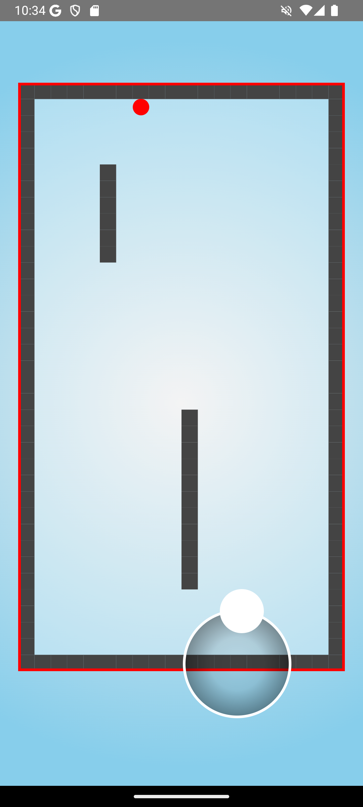
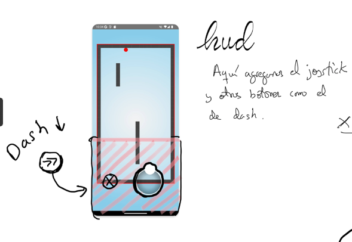

  
  

- [Introducción](#introducción)
- [Objetivo de la prueba](#objetivo-de-la-prueba)
- [The boring ball](#the-boring-ball)
- [Guía básica del código](#guía-básica-del-código)
  - [Level](#level)
  - [Hud](#hud)
  - [Personaje](#personaje)
  - [Settings](#settings)
  - [Esquema completo](#esquema-completo)

## Introducción

El campo de juego de este examen será un minijuego, **The boring ball**, con una pelota que se mueve dentro de un rectángulo, controlada por un joystick virtual. El código inicial ya impide salir de los límites y aplica una ligera aceleración.

## Objetivo de la prueba

Evaluar tu dominio de **Kotlin + Jetpack Compose** y de los componentes propios de Android, así como tu capacidad de buscar solucciónes, organización, refactorización del código.

> 🔔 **Entrega**: Sube tu el código final a GitHub classroom en este repositorio antes de la hora de finalización de la prueba.

## The boring ball

:construction:
  
## Guía básica del código

La estructura del código sigue el modelo de árbol de vistas de Jetpack Compose. La vista principal está `Level` y el resto de vistas son funciones que se llaman desde esta.

 
`MainActivity` incia el contexto de la activity y lo único que hace es llamar a la la función Level que es la que contiene el juego. 

A su vez, `Level` inicia los componentes inferiories, define sus estados inciales empezando así los subprogramas. Componentes como HUD, Character o Settings.

A nivel de architectura, hay cuatro viewModels que se encargan de gestionar el estado de la vista. `LevelViewModel`, `HudViewModel`, `CharacterViewModel` y `SettingsViewModel`. Cada uno de ellos tiene su propio estado y se encarga de gestionar los eventos que ocurren en su vista.

### Level

### Hud 

### Personaje

### Settings

### Esquema completo
_page-0001.jpg)
